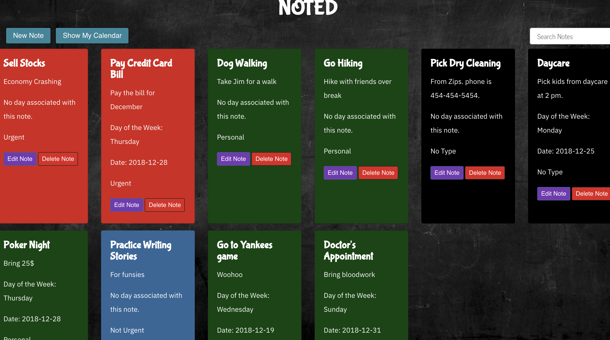
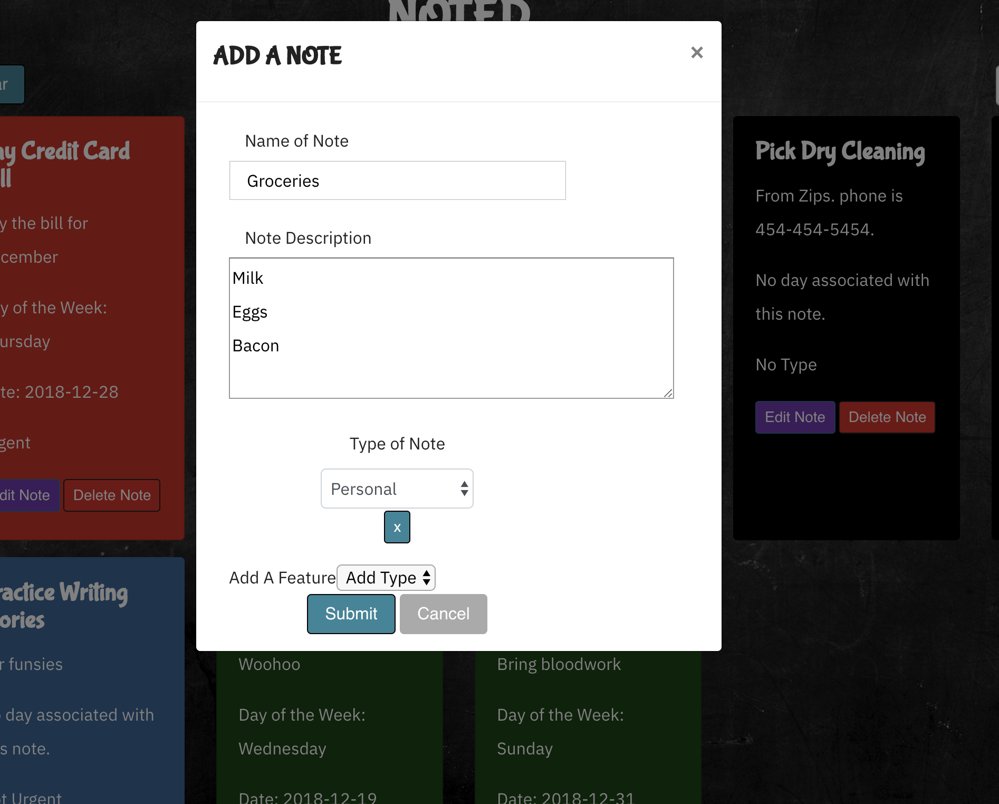
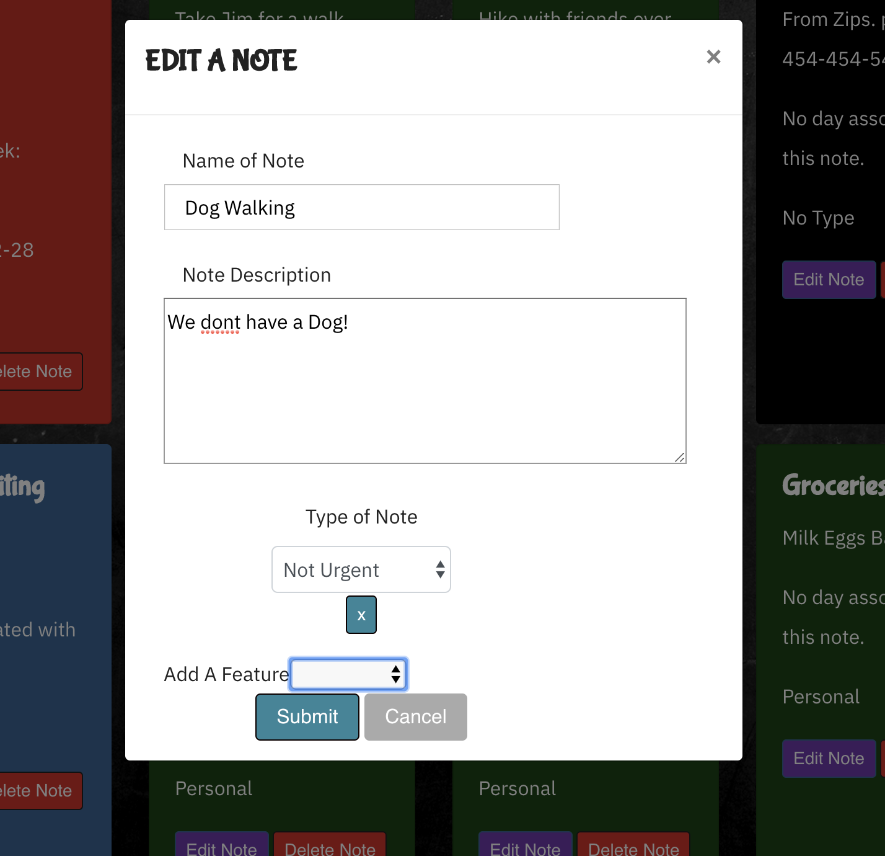
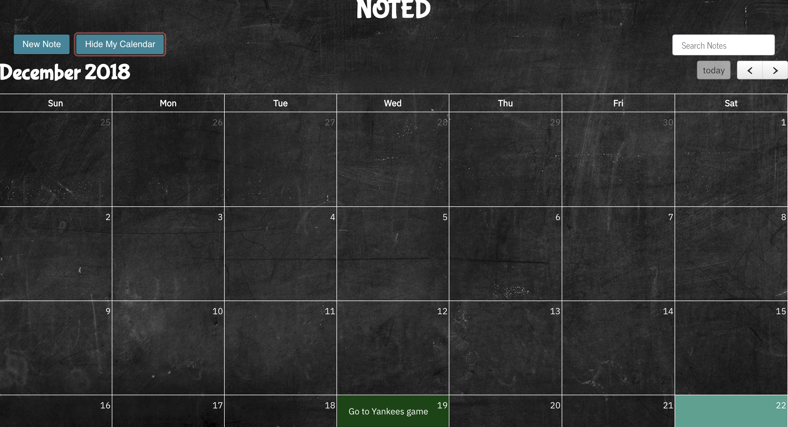
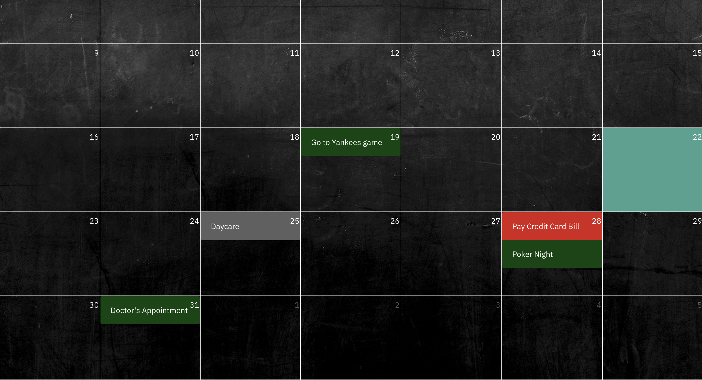

# Noted
<b> A basic note-taking single-page application with calendar functionality </b>

We built this project for our FlatIron School mod 3 project. We used it as an opportunity to learn how to create single-page applications with JavaScript. We implemented the MVC architectural pattern (Model-Controller-Adapter-View in this case).

This application allows users to create, read, update and delete (CRUD) notes and categorize them by type. It allows users to also add a date for their notes, displaying on the provided FullCalendar if they do so. Users can also search for notes. Notes marked as urgent appear first in the list of notes on the homepage.

The purpose of this application was to help ourselves get organized while learning JavaScript!


## Collaborators
- Srikant Kumar Kalaputapu, [@KSriki](https://github.com/KSriki)
- Sam Ashtar, [@samashtar](https://github.com/samashtar/)

## Tech/framework used

This is a Single-Page Application.

<b>Built with</b>
- [JavaScript](https://www.javascript.com/)
- [Ruby on Rails](https://rubyonrails.org/)
- [FullCalendar](https://fullcalendar.io/)
- [Moment](https://momentjs.com/)


## Features

- Allows users to create a note with title and description
- Urgent notes are first in list
- Allows users to assign a type (like important, work etc.) to a note (color changes depending)
- Allows users to assign a date for each note
- Allows users to edit notes
- Allows users to delete notes
- Allows users to search and find notes
- Allows users to see their notes on a calendar if a data is associated with the note.

## Possible future features

- React
- Fix modals/editing and updating
- Change workflow for calendar (React will help this a lot with lifecycle methods)


## How to use

Requires Git, Ruby, Bundler


In Terminal/Console:

```
 # Clone the front end repo
 $ git clone git@github.com:KSriki/note-app-front-end.git
 
 # Clone the back end repo
 $ git clone git@github.com:KSriki/noteapp.git
 
 # navigate to backend
 $ cd noteapp
 
 # setup backend
 $ bundle install
 
 # create the database
 $ rails db:create
 
 # migrate the database (add tables etc.)
 $ rails db:migrate

 # seed the database with base data
 $ rails db:seed

 # run the server
 $ rails s
 
 ## In another terminal window, open the front end
 $ cd note-app-front-end
 
 # Open the single page application
 $ open index.html
 
```
## Screenshots


| Homepage  |
| ------------- | 
|    | 


| Create a note | Edit a note |
| ------------- | ------------- |
|  |  | 


| Calendar 1 | Calendar 2 |
| ------------- | ------------- | 
|  |  | 


